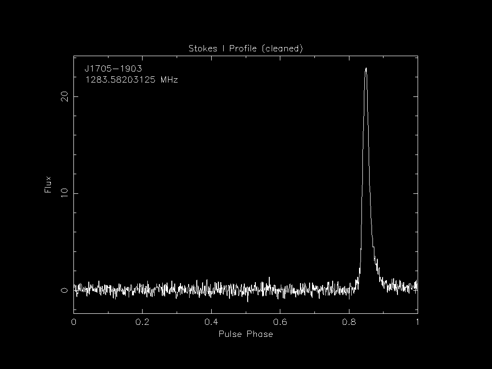
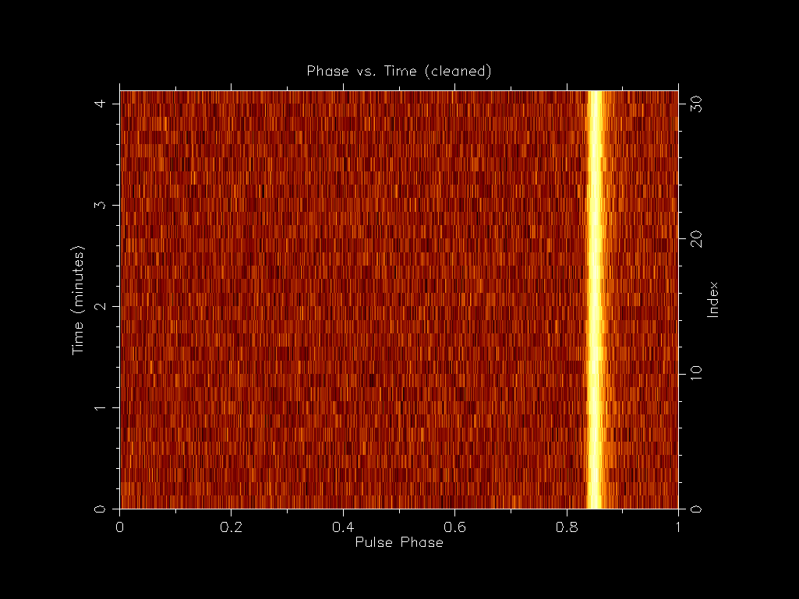
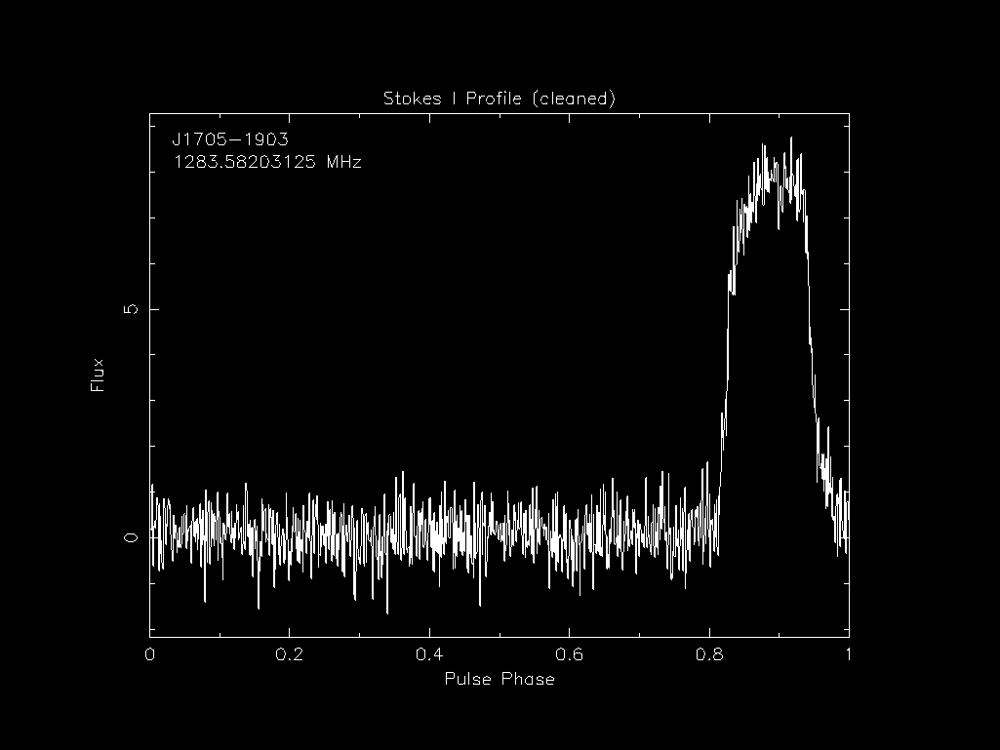
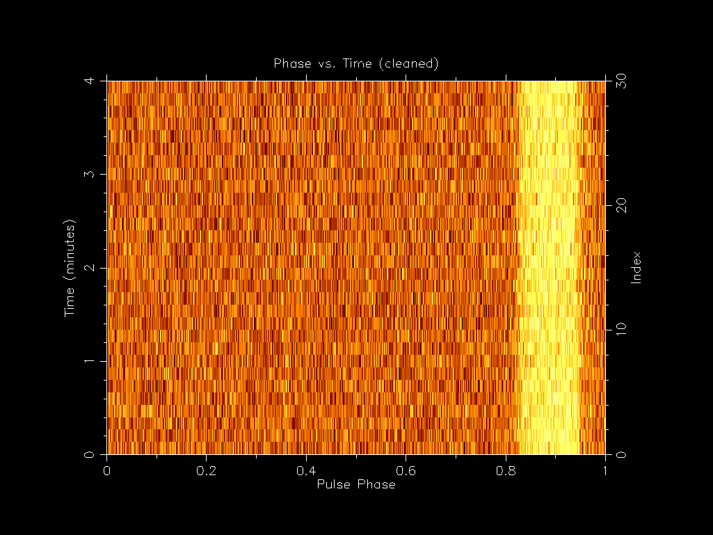
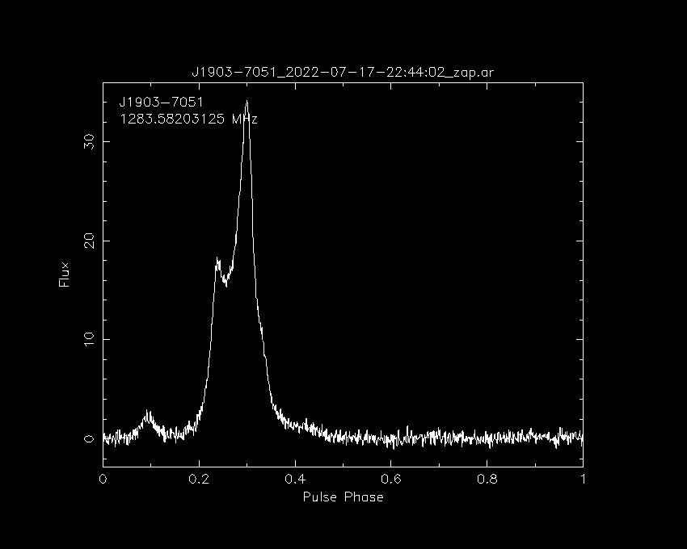
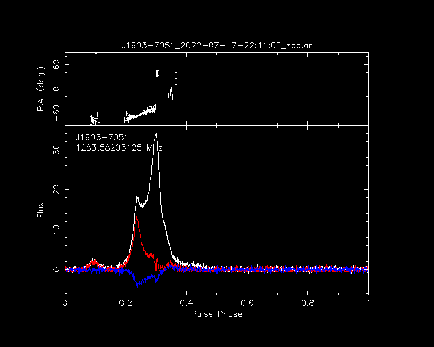
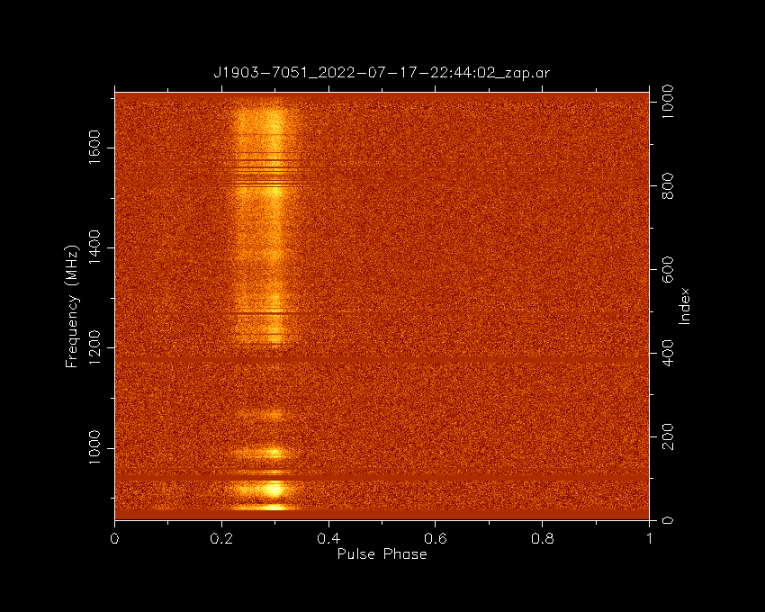
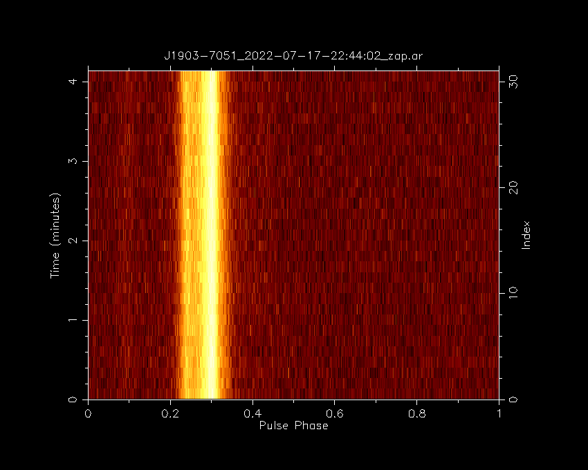
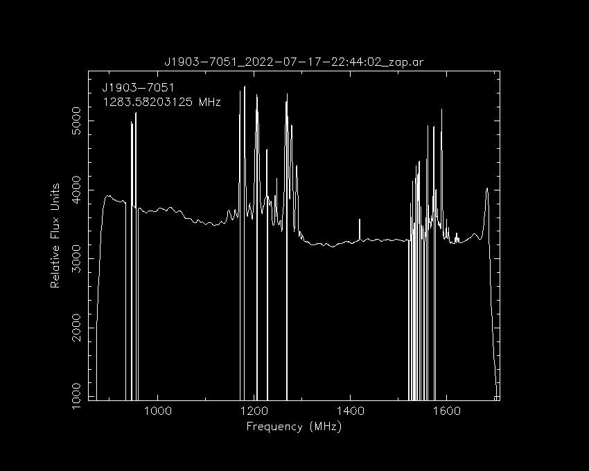

# Introduction

In this lesson we will go over how to interact with pulsar data.
We will go over the different types of data, how to plot them and how to clean them.

The data we will use for this lesson is in the `pulsar_data` directory so move to the directory before following alone:

```
cd /home/pulsar/pulsar_data_lesson
```
{: .language-bash}


## Pulsar data types

Pulsar data are typically stored as a three-dimensional array of pulse profiles the axes being time (sub-integrations), observing frequency (channels) and polarization.
Each data file (typically termed as archives) have attributes (metadata) that describe the pulsar observation.
Pulsar data can be broadly sorted into two types, "raw voltage" which is the time series data as it comes off the telescope and "folded" which has been folded and dedisperesed using a timing ephemeris.

Some formats for raw voltage files include `PSRFITS`, `PSRDADA` and `VDIF`.
Before analyzing the data you often have to fold and dedisperse the data which is often done with `dspsr` (explained in the next section).

The folded data are often called archives and have `.ar` at the end of their filename.
Many telescopes (such as MeerKAT) have a pulsar timing backend that will automatically produce a folded archive to save processing and data size.

## DSPSR

[DSPSR](https://dspsr.sourceforge.net/manuals/dspsr/) is not installed on the VM or need for MeerKAT data but it is still useful to know how to use to process other data and to understand MeerKAT data.
`dspsr` can perform phase-coherent dispersion removal while folding the data based on the input ephemeris.
The output data may be divided into sub-integrations of arbitrary length, including single pulses.
THe MeerKAT PTUSE outputs the archives in ~8 second sub-integrations so the equivalent `dspsr` command may look like this:

```
dspsr -F 128 -E 1644-4559.eph -L 8 raw_observation.data
```
where `-F 128` outputs a 128 frequency channel archive, `-E 1644-4559.eph` is the ephemeris file, `-L 8` outputs an archive for every 8 seconds of data and `raw_observation.data` is whatever the input raw voltage file is called (if there is one).

Because these archives have already been folded with an ephemeris, there is only so much you can do to improve your observation if the ephemeris is inaccurate.
For example below is a recent observation (2023-04-21-23:58:20) of PSR J1705-1903's profile and phase against time plots:




You can see that pulse is thin as expected.
If we then compare this to an early observation (2019-04-23-05:44:10) we can see that the pulse profile is much wider even though we have a applied a more recent ephemeris to it.




This is due to the PTUSE outputting the 8 second sub-integrations which have some timing smear in them due to the initial inaccurate ephemeris used during the observation.
If you ever want to inspect the ephemeris used to create an archive file you can use the following command:

```
vap -E <archive_file>
```
{: .language-bash}


## PSRCHIVE

Now that we have folded and dedisperesed archives, we can analysis them and one of the best packages to do that is PSRCHIVE.
PSRCHIVE is an Open Source C++ development library for the analysis of pulsar astronomical data.
The software is described [online](https://psrchive.sourceforge.net/index.shtml) and in [Hotan, van Straten & Manchester (2004)](http://www.publish.csiro.au/?paper=AS04022) and [Straten, Demorest & Osłowski 2012](https://arxiv.org/abs/1205.6276).

There is a [full list](https://psrchive.sourceforge.net/manuals/) of commands online and below are the most common ones:
 - `psrstat`	query attributes and statistics
 - `psradd`	combine data in various ways
 - `psrplot`	produce customized, publication quality plots
 - `vap`	output tables of parameters and derived values
 - `pav`	produce a wider variety of plots
 - `pam`	command line general purpose data reduction
 - `rmfit`	estimate the Faraday rotation measure
 - `pas`	generate template profiles (standards)
 - `pat`	produce time of arrival estimates
 - `paz`	RFI mitigation
 - `pdmp`	find optimal period and dispersion measure


## Investigating files (`vap` and `psrstat`)

Archive files have a lot of metadata associated with them and you can use the `vap` and `psrstat` command to view them.
The main difference between the two is that `vap` outputs the metadata in a table format and `psrstat` outputs it in a more human readable format and includes more statistics.

Lets look at the metadata of one of the archives we will be using for this lesson.
First lets look at the `vap` output:

```
vap -c nchan,nsub,length J1903-7051_2022-07-17-22:44:02_*.ar
```
{: .language-bash}

```
filename   nchan   nsub   length
J1903-7051_2022-07-17-22:44:02_raw.ar   1024   31   248.000
J1903-7051_2022-07-17-22:44:02_zap.ar   1024   31   248.000
```
{: .output}

```
psrstat -c nchan,nsubint,length J1903-7051_2022-07-17-22:44:02_*.ar
```
{: .language-bash}

```
J1903-7051_2022-07-17-22:44:02_raw.ar nchan=1024 nsubint=31 length=248
J1903-7051_2022-07-17-22:44:02_zap.ar nchan=1024 nsubint=31 length=248
```
{: .output}

You'll notice that they output the values in different formats and that they label the time sub-integrations differently (`nsub` vs `nsubint`).
The `psrstat` command also has access to more statistics and you can output all of the by not including the `-c` option:

```
psrstat J1903-7051_2022-07-17-22:44:02_zap.ar
```
> ## Output
> ~~~
> file             Name of the file                                             J1903-7051_2022-07-17-22:44:02_zap.ar
> nbin             Number of pulse phase bins                                   1024
> nchan            Number of frequency channels                                 1024
> npol             Number of polarizations                                      4
> nsubint          Number of sub-integrations                                   31
> type             Observation type                                             Pulsar
> site             Telescope name                                               MeerKAT
> name             Source name                                                  J1903-7051
> coord            Source coordinates                                           19:03:38.794-70:51:43.46
> freq             Centre frequency (MHz)                                       1283.58203125
> bw               Bandwidth (MHz)                                              856
> dm               Dispersion measure (pc/cm^3)                                 19.6599998474121
> rm               Rotation measure (rad/m^2)                                   18.9939160066885
> dmc              Dispersion corrected                                         0
> rmc              Faraday Rotation corrected                                   0
> polc             Polarization calibrated                                      0
> scale            Data units                                                   FluxDensity
> state            Data state                                                   Coherence
> length           Observation duration (s)                                     248
> int*:@           int:help for attribute list
> ext:obs_mode     Observation Mode                                             PSR
> ext:obsfreq      Centre frequency                                             1283.58203125
> ext:obsbw        Bandwidth                                                    856
> ext:obsnchan     Number of channels                                           1024
> ext:hdrver       Header Version                                               6.7
> ext:date         File Creation Date                                           2023-09-06T11:14:39
> ext:coord_md     Coordinate mode                                              J2000
> ext:equinox      Coordinate equinox                                           2000
> ext:trk_mode     Tracking mode                                                TRACK
> ext:bpa          Beam position angle                                          0
> ext:bmaj         Beam major axis                                              0
> ext:bmin         Beam minor axis                                              0
> ext:stt_date     Start UT date                                                2022-07-17
> ext:stt_time     Start UT                                                     22:44:02
> ext:stt_imjd     Start MJD                                                    59777
> ext:stt_smjd     Start second                                                 81851
> ext:stt_offs     Start fractional second                                      0.996758526449667
> ext:stt_lst      Start LST                                                    0
> ext:stt_crd1     Start coord 1                                                19:03:38.7935
> ext:stt_crd2     Start coord 2                                                -70:51:43.461
> ext:stp_crd1     Stop coord 1                                                 19:03:38.7935
> ext:stp_crd2     Stop coord 2                                                 -70:51:43.461
> ext:ra           Right ascension                                              19:03:38.794
> ext:dec          Declination                                                  -70:51:43.461
> obs:observer     Observer name(s)                                             Ryan
> obs:projid       Project name                                                 SCI-20180516-MB-05
> itrf:ant_x       ITRF X coordinate.                                           5109360.133
> itrf:ant_y       ITRF Y coordinate.                                           2006852.586
> itrf:ant_z       ITRF Z coordinate.                                           -3238948.127
> rcvr:name        Receiver name                                                KAT
> rcvr:basis       Basis of receptors                                           lin
> rcvr:hand        Hand of receptor basis                                       -1
> rcvr:sa          Symmetry angle of receptor basis                             45deg
> rcvr:rph         Reference source phase                                       0deg
> rcvr:fdc         Receptor basis corrected                                     1
> rcvr:prc         Receptor projection corrected                                1
> rcvr:ta          Tracking angle of feed                                       0deg
> be:name          Name of the backend instrument                               MKBF
> be:phase         Phase convention of backend                                  +1
> be:dcc           Downconversion conjugation corrected                         0
> be:phc           Phase convention corrected                                   0
> be:delay         Backend propn delay from digi. input.                        0
> be:config        Configuration filename
> be:nrcvr         Number of receiver channels                                  2
> be:tcycle        Correlator cycle time                                        8
> hist:nrow        Number of rows in history                                    12
> hist:nbin_prd    Nr of bins per period                                        1024
> hist:tbin        Time per bin or sample                                       3.51344981959837e-06
> hist:chan_bw     Channel bandwidth                                            0.8359375
> hist:cal_file    Calibrator filename                                          NONE
> aux:dm_model     Auxiliary dispersion model                                   NONE
> aux:dmc          Auxiliary dispersion corrected                               0
> aux:rm_model     Auxiliary birefringence model                                NONE
> aux:rmc          Auxiliary birefringence corrected                            0
> sub:int_type     Time axis (TIME, BINPHSPERI, BINLNGASC, etc)                 TIME
> sub:int_unit     Unit of time axis (SEC, PHS (0-1), DEG)                      SEC
> sub:tsamp        [s] Sample interval for SEARCH-mode data                     0
> sub:nbits        Nr of bits/datum (SEARCH mode 'X' data, else 1)              -1
> sub:nch_strt     Start channel/sub-band number (0 to NCHAN-1)                 -1
> sub:nsblk        Samples/row (SEARCH mode, else 1)                            1
> sub:nrows        Nr of rows in subint table (search mode)                     31
> sub:zero_off     Zero offset for SEARCH-mode data                             0
> sub:signint      1 for signed ints in SEARCH-mode data, else 0                0
> subint           Sub-integration index                                        0
> chan             Frequency channel index                                      0
> pol              Polarization index                                           0
> include[:@]      Estimator of included bins
> exclude[:@]      Estimator of excluded bins
> on[:@]           On-pulse estimator                                           consecutive:{threshold=3,consecutive=3}
> on:count         Count of selected phase bins                                 0
> on:start         Start of the phase region
> on:end           End of the phase region
> on:min           minimum value                                                nan
> on:max           maximum value                                                nan
> on:range         range of values                                              nan
> on:sum           sum of values                                                nan
> on:avg           average of values                                            nan
> on:rms           standard deviation of values                                 nan
> on:mu3           skewness of values                                           nan
> on:mu4           kurtosis of values                                           nan
> on:dev           coefficient of deviation of values                           nan
> on:med           median of values                                             nan
> on:mdm           median absolute difference from median                       nan
> on:iqr           inter-quartile range of values                               nan
> on:qcd           quartile coefficient of dispersion                           nan
> on:qcs           quartile coefficient of skewness                             nan
> on:ock           octile coefficient of kurtosis                               nan
> on:ft1           first harmonic of values                                     nan
> on:ftN           last harmonic of values                                      nan
> on:mh2           maximum harmonic in upper half-spectrum                      nan
> on:ftm           median harmonic in upper half-spectrum                       nan
> on:sm2           total power in upper half-spectrum                           nan
> on:sm3           skew of upper half-spectrum                                  nan
> on:sm4           kurtosis of upper half-spectrum                              nan
> on:sho           sum of harmonic outlier power                                nan
> on:sdo           sum of detrended outlier power                               nan
> on:fte           spectral entropy                                             nan
> on:cbp           best-fit phase of cyclic box car                             nan
> off[:@]          Off-pulse estimator                                          minimum:{smooth[:@]=mean:{width=0.150000005960464},find_min=1,find_mean=0,search=0:0,found=0.0929687470197678:0.242968752980232}
> off:count        Count of selected phase bins                                 154
> off:start        Start of the phase region                                    95
> off:end          End of the phase region                                      248
> off:min          minimum value                                                684.793518066406
> off:max          maximum value                                                733.203979492188
> off:range        range of values                                              48.4104614257812
> off:sum          sum of values                                                109085.38885498
> off:avg          average of values                                            708.346680876497
> off:rms          standard deviation of values                                 8.90468957888328
> off:mu3          skewness of values                                           0.00585555706206417
> off:mu4          kurtosis of values                                           2.82917703966072
> off:dev          coefficient of deviation of values                           0.0125710895798435
> off:med          median of values                                             708.860107421875
> off:mdm          median absolute difference from median                       6.20037841796875
> off:iqr          inter-quartile range of values                               13.1571655273438
> off:qcd          quartile coefficient of dispersion                           0.00928900443988446
> off:qcs          quartile coefficient of skewness                             -0.0985447679839679
> off:ock          octile coefficient of kurtosis                               1.10618508398781
> off:ft1          first harmonic of values                                     10.8299932479858
> off:ftN          last harmonic of values                                      23.8169898986816
> off:mh2          maximum harmonic in upper half-spectrum                      268.957733154297
> off:ftm          median harmonic in upper half-spectrum                       51.8983421325684
> off:sm2          total power in upper half-spectrum                           5510.18733417172
> off:sm3          skew of upper half-spectrum                                  -0.297201795034637
> off:sm4          kurtosis of upper half-spectrum                              2.49651352866569
> off:sho          sum of harmonic outlier power                                0
> off:sdo          sum of detrended outlier power                               3508.27220403776
> off:fte          spectral entropy                                             3.30974334238639
> off:cbp          best-fit phase of cyclic box car                             0.38961038961039
> all:count        Count of selected phase bins                                 1024
> all:start        Start of the phase region
> all:end          End of the phase region
> all:min          minimum value                                                681.297607421875
> all:max          maximum value                                                740.071960449219
> all:range        range of values                                              58.7743530273438
> all:sum          sum of values                                                727073.934204102
> all:avg          average of values                                            710.033138871193
> all:rms          standard deviation of values                                 8.73123854615207
> all:mu3          skewness of values                                           0.0212097780209406
> all:mu4          kurtosis of values                                           3.03962717627088
> all:dev          coefficient of deviation of values                           0.0122969451257345
> all:med          median of values                                             710.058044433594
> all:mdm          median absolute difference from median                       5.86480712890625
> all:iqr          inter-quartile range of values                               11.6577758789062
> all:qcd          quartile coefficient of dispersion                           0.00820995363549673
> all:qcs          quartile coefficient of skewness                             -0.0137014989450317
> all:ock          octile coefficient of kurtosis                               1.30218166397035
> all:ft1          first harmonic of values                                     142.131988525391
> all:ftN          last harmonic of values                                      21.0218658447266
> all:mh2          maximum harmonic in upper half-spectrum                      440.245025634766
> all:ftm          median harmonic in upper half-spectrum                       52.1071815490723
> all:sm2          total power in upper half-spectrum                           35968.0589712215
> all:sm3          skew of upper half-spectrum                                  0.0211442316706619
> all:sm4          kurtosis of upper half-spectrum                              3.48672406277501
> all:sho          sum of harmonic outlier power                                54.2748589515686
> all:sdo          sum of detrended outlier power                               23408.4130098559
> all:fte          spectral entropy                                             4.79931536212596
> all:cbp          best-fit phase of cyclic box car                             0.6005859375
> width[:@]        Pulse width (turns)                                          0
> snr[:@]          Signal-to-noise ratio                                        5.83387851715088
> sumI             Total flux in on-pulse phase bins                            0
> sumP             Total polarized flux of on-pulse phase bins                  0
> sumL             Total linearly polarized flux of on-pulse phase bins         0
> sumV             Total Stokes V of on-pulse phase bins                        0
> sumC             Total circularly polarized flux |V| of on-pulse phase bins   0
> sumS             Total coherency matrix determinant of on-pulse phase bins    0
> varL             Variance of the off-pulse linearly polarized flux            144.241568624316
> peak             Phase of pulse peak (turns)                                  0.5703125
> weff             Effective pulse width (turns)                                -nan
> nfnr             Noise-to-Fourier-noise ratio                                 1.06242525577545
> ncal             Number of CAL transitions                                    0
> d2bit            2-bit distortion                                             0
> wtfreq           Weighted frequency                                           1288.502
> bwidth           Phase bin width                                              3.51344981959837e-06
> dsmear           Dispersive smearing in worst channel                         0.000217444879083687
> ~~~
> {: .output}
{: .solution}

Which is nice and verbose, explaining what each attribute is, but is large and perhaps a bit overwhelming.

## Making plots

One of the best commands to make plots is `psrplot`.
You can list all the types of plots that you can make with

```
psrplot -P
```
{: .language-bash}

```
Available Plots:
flux      [D]  Single plot of flux
stokes    [s]  Stokes parameters
Scyl      [S]  Stokes; vector in cylindrical
Scyl+     [E]  Stokes; vector in cylindrical+
Ssph      [m]  Stokes; vector in spherical
Sfluct    [U]  Stokes; fluctuation power spectra
Sflph     [u]  Stokes; fluctuation phase spectra
freq      [G]  Phase vs. frequency image of flux
freq+     [F]  freq + integrated profile and spectrum
time      [Y]  Phase vs. time image of flux
pa        [o]  Orientation (Position) angle
ell       [e]  Ellipticity angle
p3d       [P]  Stokes vector in Poincare space
pahist    [h]  Phase-resolved position angle histogram
pahist+   [H]  Phase-resolved PA histogram and total profile
psd       [b]  Pulsed power spectrum
2bit      [2]  Two-bit distribution
cal       [C]  Calibrator Spectrum
calm      [M]  Calibrator model information
calp      [p]  Calibrator parameter
line      [R]  Line phase subints
dspec     [j]  Dynamic S/N spectrum
dstat     [d]  Dynamic statistic spectrum
offdspec  [r]  Dynamic baseline spectrum
dcal      [l]  Calibrator dynamic spectrum
dweight   [w]  Weights dynamic spectrum
snrspec   [n]  S/N ratio
calphvf   [X]  Calibrator phase vs frequency plot
bandpass  [B]  Display original bandpass
chweight  [c]  Display Channel Weights
bpcw      [J]  Plot off-pulse bandpass and channel weights
digstats  [K]  Digitiser Statistics
digcnts   [A]  Digitiser Counts histogram
fourth    [4]  4x4 covariance of Stokes parameters
cross     [x]  1-D cross covariances between Stokes parameters
alt       [a]  Greyscale of auxiliary profiles
```
{: .output}

Some of the common types we will go over soon.
First we should explain some of the other `psrplot` commands.

You can preprocess the archives before plotting with the `-j` option.
The pre-processing is done with the `psrsh` command and you can find the full list of options with `psrsh -H`.
The following commands are the most common ones:
 - `T` Time scrunch to one subint
 - `F` Frequency scrunch to one channel
 - `p` Polarisation scrunch to total intensity
 - `D` Dedisperse (but not fscrunch)
 - `S` Transform to Stokes parameters
For example `-jTFDp` will dedisperse and time, frequency and polarisation scrunch.

You can define how to output the plot with the `-D` option so you could output the plot as a png with `-D output_name.png/png`.

### Pulse profile

Lets give it a go and try to make a pulse profile plot with the command:

```
psrplot -p flux -jFTDp -D J1903-7051_profile_fts.png/png J1903-7051_2022-07-17-22:44:02_zap.ar
```
{: .language-bash}



You can also remove the `-D J1903-7051_profile_fts.png/png` part and it will open the plot in a window.
Now lets go through all the common plot type commands

### Polarisation (Stokes) profile
```
psrplot -p Scyl -jFTD -D \J1903-7051_profile_ftp.png/png J1903-7051_2022-07-17-22:44:02_zap.ar
```
{: .language-bash}



### Phase vs. Frequency
```
psrplot -p freq -jTDp -D J1903-7051_phase_freq.png/png J1903-7051_2022-07-17-22:44:02_zap.ar
```
{: .language-bash}



### Phase vs. Time
```
psrplot -p time -jFDp -D J1903-7051_phase_time.png/png J1903-7051_2022-07-17-22:44:02_zap.ar
```
{: .language-bash}



### Cleaned bandpass
```
psrplot -p b -jT -D J1903-7051_bandpass.png/png J1903-7051_2022-07-17-22:44:02_zap.ar
```
{: .language-bash}




## RFI cleaning

While most telescopes are situated in radio quiet zones, it is impossible to remove all sources of RFI.
For this reason, it is important to remove RFI from your data before analysis.
The `J1903-7051_2022-07-17-22:44:02_zap.ar` archive has already been RFI cleaned and we can see in the bandpass which frequencies were flagged:


Mention options

Show how to output bandpass

#Chalenge can you remove this bit of RFI


## Decimating

define nchan and nsub


## psrstat

## Organisation

Notes, dump history maybe make a trello board. Make repeatable workflow scripts
